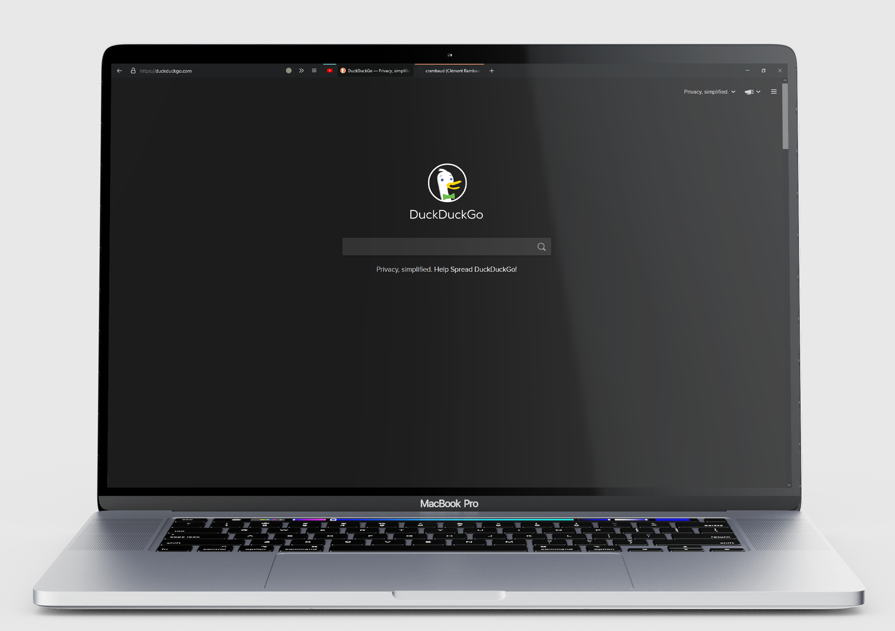

# Waterfall



## Description
Waterfall is a fork of the beautiful [Cascade](https://github.com/andreasgrafen/cascade) custom CSS theme for firefox by [Andreas Grafen](https://andreas.grafen.info). The goal is to make a mouse-centered cascade custom CSS theme.

what this theme brings back :
- window control buttons
- back button
- close tab button on hover
- hamburger menu

## Themes


Waterfall is available in both dark and light theme. The default theme is dark. To change from dark to light theme, you'll need to comment the those lines in the `userchrome.css` file :
```CSS
--window-colour:               #1f2122;
--secondary-colour:            #141616;
--inverted-colour:             #FAFAFC;
```
and uncomment those lines :
```CSS
--window-colour:               #FAFAFC;
--secondary-colour:            #EAEAEC;
--inverted-colour:             #1E2021;
```

## Installation

- In the ```about:config``` page on your Firefox browser, set the following parameters to **True** :
  - ```toolkit.legacyUserProfileCustomizations.stylesheets```
  - ```layers.acceleration.force-enabled```
  - ```gfx.webrender.all```
  - ```svg.context-properties.content.enabled```
- Copy the userChrome.css file from this repository to your **chrome** folder. You can find the **chrome** folder here :
  - On Linux : ```$HOME/.mozilla/firefox/######.default-release/chrome/```
  - On Windows : ```C:\Users\[USERNAME]\AppData\Roaming\Mozilla\Firefox\Profiles\######.default-release\chrome\```
  - On MacOS : ```Users/[USERNAME]/Library/Application Support/Firefox/Profiles/######.default-release/chrome```
  - If it doesn't exist already create a folder called chrome

## Authors:

- Andreas Grafen (original cascade theme) (https://andreas.grafen.info)
- Clément Rambaud (mods on the original file for a mouse-centered use)
‎
## License

See [LICENSE](LICENSE).